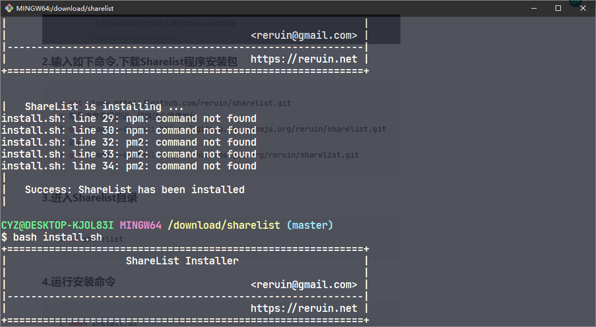
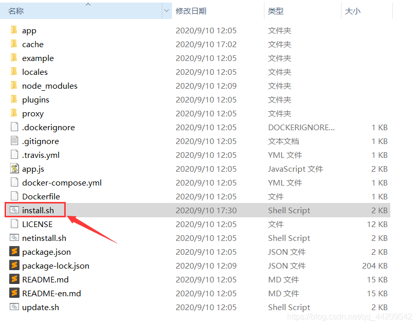
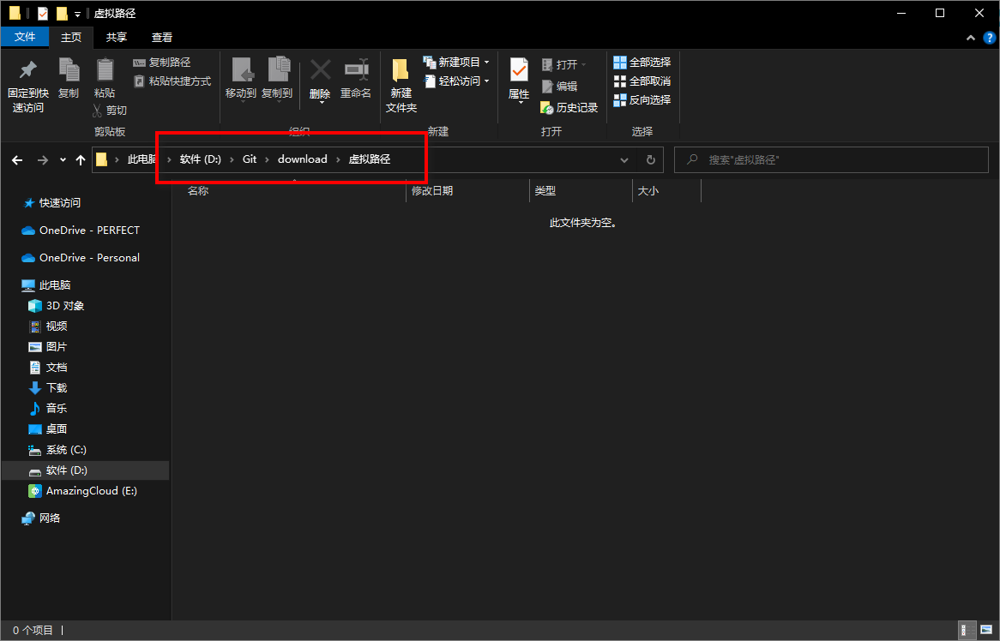
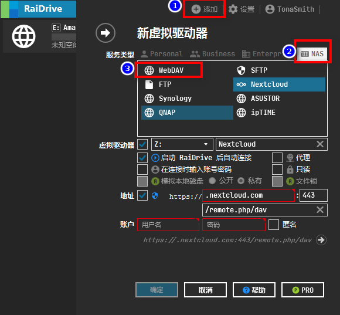
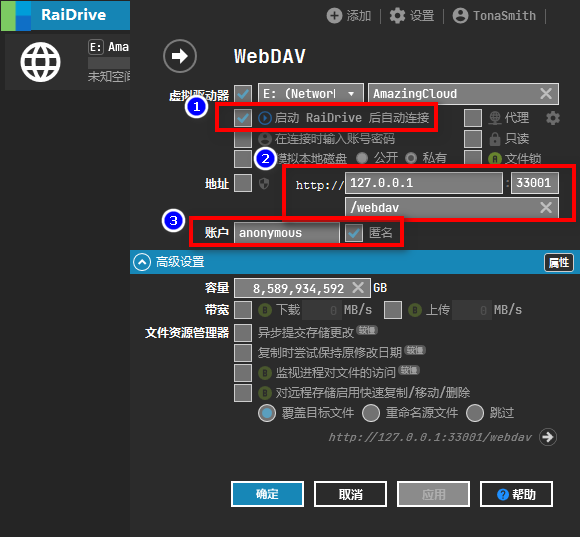
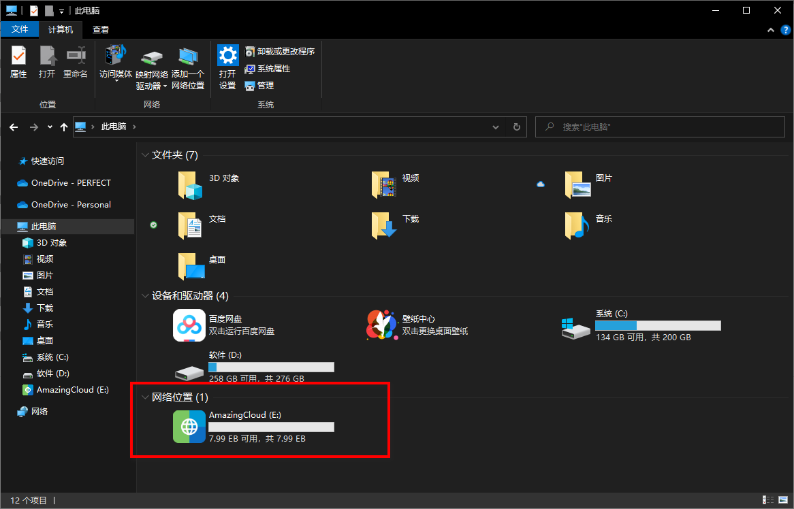

# Ⅰ、// 电脑端安装（WIN）

## 一、环境搭建

### 1. 安装Git命令行工具

详情想看 “杂谈手记” 👉 ”WIN下安装Git并美化”一文

[杂谈手记” 👉 ”WIN下安装Git并美化](https://github.com/TonaSmith/How-To-Play-Sharelist/blob/master/%E6%9D%82%E8%B0%88%E6%89%8B%E8%AE%B0/WIN%E4%B8%8B%E5%AE%89%E8%A3%85Git%E5%B9%B6%E7%BE%8E%E5%8C%96.md)

### 2.安装Node.JS

详情想看 “杂谈手记” 👉 ”WIN下安装简易Web服务器环境”一文

[杂谈手记” 👉 ”WIN下安装简易Web服务器环境](https://github.com/TonaSmith/How-To-Play-Sharelist/blob/master/%E6%9D%82%E8%B0%88%E6%89%8B%E8%AE%B0/WIN%E4%B8%8B%E5%AE%89%E8%A3%85%E7%AE%80%E6%98%93Web%E6%9C%8D%E5%8A%A1%E5%99%A8%E7%8E%AF%E5%A2%83.md)

### 3.安装pm2管理工具

在Git命令行工具中输入如下指令：

```bash
npm i pm2 -g
```

安装过后记得查看是否成功

```bash
node -v
pm2 -v
```

## 二、安装Sharelist

### 1.打开Git命令行工具,进入要安装Sharelist的目录

我这里以D:/Git/download目录为例


### 2.输入如下命令,下载Sharelist程序安装包

```bash
#本地安装
git clone https://github.com/reruin/sharelist.git 
如果速度很慢的话，切换这个镜像地址
git clone --depth=1 https://github.com.cnpmjs.org/reruin/sharelist.git
或者
git clone --depth=1 https://hub.fastgit.org/reruin/sharelist.git


#远程安装（可选）
wget --no-check-certificate -qO-  https://raw.githubusercontent.com/reruin/sharelist/master/netinstall.sh | bash

#更新
bash update.sh
```

### 3.进入Sharelist目录

```bash
cd sharelist
```

### 4.运行安装命令

```bash
bash install.sh
```

### 5.此时打开 "http://localhost:33001"并显示界面,即为安装成功

### 6.安装报错,进行排查



当显示npm和pm2命令找不到时，进入sharelist文件夹，打开install.sh文件：



使用VS Code或者别的文本编辑器打开这个文件

注释掉这一行


这是一段PATH路径寻址的代码，因为我在安装Node.js环境时配置了全局环境变量，可能导致了它加载不到正确的路径，所以我们注释掉这段代码，就可以依靠全局环境变量正确寻址。

注释完毕重新安装Sharelist即可

## 三、启动并配置Sharelist挂载各大网盘

### 1.首次启动要配置网站管理员密码、名称、虚拟路径等等。随意，后期可改


### 2.点击页面下方的管理，输入刚刚设置的管理员密码，进入管理后台

### 3.配置自己所需的网盘,具体可以参考官方文档

[大神的官方文档：ShareList Docs](https://reruin.github.io/sharelist/docs/#/zh-cn/)


### 4.逆天功能介绍：虚拟路径

① 首先创建一个文件夹，随便在哪都行,我这里D:\Git\download\虚拟路径



② 然后创建一个`.d.ln`格式的文件,我这里以`ctcc.d.ln`为例


③ 文件的内容格式是这样 `挂载标识:挂载内容`

**具体如下：👇**

[Sharelist虚拟路径挂载配置内容](https://github.com/TonaSmith/How-To-Play-Sharelist/tree/master/%E6%9D%82%E8%B0%88%E6%89%8B%E8%AE%B0/Sharelist虚拟路径挂载配置内容.md7)

④ 然后在Sharelist的管理后台绑定虚拟路径


⑤ 然后在首页刷新，出现“目录选项”


⑥ 点击进去，这个`ctcc`其实就是等效于首页的`ctcc`文件夹了


## 四、配置Sharelist挂载WebDav

如下配置即可👇


`WedDav可以把整个虚拟路径的配置转出，方便我们等下搭配RaiDrive映射本地硬盘`

## 五、使用RaiDrive本地挂载硬盘

### 1.下载、安装RaiDrive

[点我下载：RaiDrive, The Best Way to the remote storage](https://www.raidrive.com/download)

### 2.配置RaiDrive



### 3.配置信息如下



### 4.这样就是挂载成功了


### 5.成果如下




## 六、其他的注意事项👇

[Sharelist的其他注意事项](https://github.com/TonaSmith/How-To-Play-Sharelist/tree/master/%E6%9D%82%E8%B0%88%E6%89%8B%E8%AE%B0/Sharelist的其他注意事项.md)

## 七、设置pm2自启动sharelist

```bash
pm2 start app.js --name sharelist --env prod //开启sharelist进程
pm2 save //保存进程信息
pm2 startup //开机自启动
```

## 八、pm2常用命令

```bash
pm2 start app.js # 启动app.js应用程序
pm2 start app.js -i 4 # cluster mode 模式启动4个app.js的应用实例
# 4个应用程序会自动进行负载均衡
pm2 start app.js --name="api" # 启动应用程序并命名为 "api"
pm2 start app.js --watch # 当文件变化时自动重启应用
pm2 start script.sh # 启动 bash 脚本

pm2 list # 列表 PM2 启动的所有的应用程序
pm2 monit # 显示每个应用程序的CPU和内存占用情况
pm2 show [app-name] # 显示应用程序的所有信息

pm2 logs # 显示所有应用程序的日志
pm2 logs [app-name] # 显示指定应用程序的日志
pm2 flush

pm2 stop all # 停止所有的应用程序
pm2 stop 0 # 停止 id为 0的指定应用程序
pm2 restart all # 重启所有应用
pm2 reload all # 重启 cluster mode下的所有应用
pm2 gracefulReload all # Graceful reload all apps in cluster mode
pm2 delete all # 关闭并删除所有应用
pm2 delete 0 # 删除指定应用 id 0
pm2 scale api 10 # 把名字叫api的应用扩展到10个实例
pm2 reset [app-name] # 重置重启数量

pm2 startup # 创建开机自启动命令
pm2 save # 保存当前应用列表
pm2 resurrect # 重新加载保存的应用列表
pm2 update # Save processes, kill PM2 and restore processes
pm2 generate # Generate a sample json configuration file
pm2 start app.js --node-args="--max-old-space-size=1024"
```

# Ⅱ、// 电脑端安装（Linux）

> Linux桌面端

首先很遗憾的是，RaiDrive的客户端只支持WIN系统。如果你电脑的主力系统是Linux，那么搭建完Sharelist以后只能用在网页访问，没法映射磁盘。


### 1.安装Git

```bash
#Debian/Ubuntu 系统及其发行分支
sudo apt-get -y install git

CentOS/RHEL 系统及其发行分支
sudo yum -y install git
```

### 2.下载Sharelist

```bash
#本地安装
git clone https://github.com/reruin/sharelist.git 
如果速度很慢的话，切换这个镜像地址
git clone --depth=1 https://github.com.cnpmjs.org/reruin/sharelist.git
或者
git clone --depth=1 https://hub.fastgit.org/reruin/sharelist.git


#远程安装（可选）
wget --no-check-certificate -qO-  https://raw.githubusercontent.com/reruin/sharelist/master/netinstall.sh | bash

#更新
bash update.sh
```

### 3.安装Sharelist

```bash
cd sharelist
bash install.sh
```

### 4.启动Sharelist

浏览器输入http://localhost:33001即可

### 5.设置自启动命令同WIN

> Linux服务器端

上述不管是WIN还是Linux桌面端，都无法摆脱的问题是电脑一关机Sharelist也就关闭了，对于搞资源分享的小伙伴来说不是很友好啊，那么如果你有这个需求恰好还有一台Linux服务器的话，不妨试试这样配置，能实现24H不间断的服务。

### 1.至5.同桌面端

### 6.安装宝塔，配置好Web环境

我估摸着能看到这里的都是老司机了，我就不赘述这些过程了

### 7.建立好一个新的站点，绑定、解析好域名

### 8.域名反代，如图所示


### 9.启动Sharelist

接下来在任何一台设备输入站点域名即可成果启动Sharelist

### 10.映射磁盘

虽然Sharelist服务端在Linux服务器上跑着，但只要你工作的电脑不是Linux而是WIN，那么你也可以像文章一开始那样映射磁盘，只需要修改一下RaiDrive的配置：将127.0.0.1改为👉宝塔面板绑定的Sharelist域名；33001端口改为👉网站域名端口（默认80端口）

## Ⅲ、//手机端安装

### 1.下载Termux

Termux是一个命令行工具，前往官网下载最新版

[点我下载:Termux](https://termux.com)

### 2.安装git

```bash
pkg install git
```

### 3.安装Node.js

```bash
pkg install nodejs
```

### 4.下载Sharelist

```bash
#本地安装
git clone https://github.com/reruin/sharelist.git 
如果速度很慢的话，切换这个镜像地址
git clone --depth=1 https://github.com.cnpmjs.org/reruin/sharelist.git
或者
git clone --depth=1 https://hub.fastgit.org/reruin/sharelist.git


#远程安装（可选）
wget --no-check-certificate -qO-  https://raw.githubusercontent.com/reruin/sharelist/master/netinstall.sh | bash

#更新
bash update.sh
```

### 5.安装Sharelist

```bash
cd sharelist
bash install.sh
```

### 6.安装npm

```text
npm install
```

### 7.安装pm2

```text
npm i pm2 -g
```

### 8.启动Sharelist服务

```text
pm2 start app.js --name sharelist --env prod
```

### 9.输入网址"http://127.0.0.1:33001",完成！


https://img.shields.io/badge/Sharelist-Thanks-brightgreen
