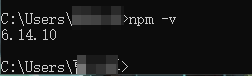

### 1.安装 Node 和 npm

- Node 是服务器端运行 Js 代码的引擎；npm 则是依赖包管理工具，可以轻松安装工具和代码类库。

① 进入Node官网，下载对应版本

[下载 | Node.js 中文网](http://nodejs.cn/download/)

②双击安装包，npm会自动安装

③进入cmd，输入如下命令npm是否安装成功

```text
npm -v
```

- 输出版本号则是安装成功



### 2.一行命令安装 serve 工具

```text
npm i -g serve
```

### 3.CMD进入源代码目录（我这里是 D盘的目录`TEST`）

```text
#先从C盘切换到D盘
D：
#然后进入代码目录
cd D:\TEST
```

### 4.启动serve服务

```text
serve
#如下图则是成功了
```


